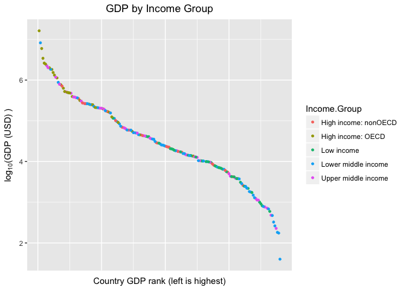
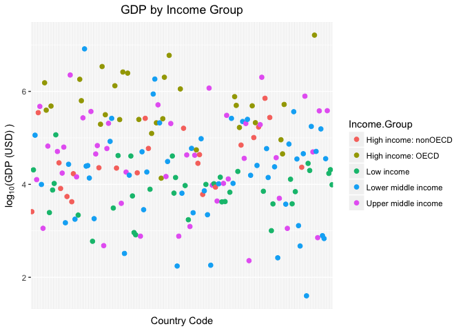

# 6306_case_study1



Introduction:
We are living in an increasingly global world. With the rapid developement of technology in the past century, we have gone from countless small, mostly isolated populations to one large, connected population on the global scale. With technological and scientific development came economic and population growth on a global scale. Still, countries underwent different levels of growth. We will be comparing the GDP's of several countries and examine some factors that are related to GDP. 



```r
nrow(merged.data)
```

```
## [1] 189
```
We have complete GDP data (Raw GDP and Income Group) for 189 different countries in the world. 


```r
order.data<-merged.data.sub[order(merged.data.sub$gdp),]
order.data[13,]$country.name
```

```
## [1] "St. Kitts and Nevis"
```
We can see that the country with the 13th lowest GDP is St. Kitts and Nevis. 


The Organisation for Economic Co-operation and Development (OECD) is an international economic organization involving the governments of 35 countries across the world. Member countries commit themselves to democracy and a market economy and cooperate with one another to identify and implement practices and policies with the ultimate goal of economic growth and security for their citizens.
The members of OECD are in general stronger economically than non-OECD countries. 

```r
hiOECD <- mean(merged.data.sub$rank[which(merged.data.sub$Income.Group=="High income: OECD")])
hiOECD
```

```
## [1] 32.96667
```

```r
hiNonOECD <- mean(merged.data.sub$rank[which(merged.data.sub$Income.Group=="High income: nonOECD")])
hiNonOECD
```

```
## [1] 91.91304
```
We can see that members of the OECD are generally higher ranked than non-members, with the average rank of members being 32.9667 and non-members having averge rank of 91.91394.

* Histogram of GDP for all countries, colors grouped by Income.Group


* Scatterplot of GDP for all countries, colors grouped by Income.Group

```r
## GDP converted to log10 scale for better data visualization
merged.data.sub$loggdp <- log10(merged.data.sub$gdp * 1000000)
#ggplot(merged.data.sub, aes(x=rank, y=loggdp)) + 
  # fill depends on Income.Group
#  geom_bar(aes(fill=Income.Group),  
#           stat="identity"
#  )+
  # Added axises title and hide x-axis text
#  labs(x = "Country (Higher incomes in left)",y="Log GDP(USD)",title="GDP by Income Group") +
#  theme(axis.text.x=element_blank(),
#        axis.ticks.x=element_blank())
#sorted.data <- merged.data.sub[order(gdp)]
#sorted.data[ra]

ggplot(merged.data.sub, aes(x=country.code, y=gdp)) + 
  # ?Draw lines in same group. colour, group both depend on Income.Group
  # geom_line(aes(colour=Income.Group, group=Income.Group)) + 
  # Set points. colour depends on Income.Group
  geom_point(aes(colour=Income.Group),size=2)+ 
  # # Added axises title and hide x-axis text
  labs(x = "Country Code",y="GDP (USD)",title="GDP by Income Group") +
  theme(axis.text.x=element_blank(),
        axis.ticks.x=element_blank(),
        plot.title = element_text(hjust = 0.5))
```



This scatterplot confirms the previous observation, OECD members generally have higher GDPs than non members. Not only that, it illustrates that high income non-OECD members have lower GDP than some countries with lower incomes. At this scale however, it is difficult to discern the differences in income between most countries because of extremely large outliers. We will therefore examine log-transformed data. 

```r
ggplot(merged.data.sub, aes(x=country.code, y=log10(gdp))) + 
  # ?Draw lines in same group. colour, group both depend on Income.Group
  # geom_line(aes(colour=Income.Group, group=Income.Group)) + 
  # Set points. colour depends on Income.Group
  geom_point(aes(colour=Income.Group),size=2)+ 
  # # Added axises title and hide x-axis text
  labs(x = "Country Code",y=expression('log'[10]*'(GDP (USD) )'),title="GDP by Income Group") +
  theme(axis.text.x=element_blank(),
        axis.ticks.x=element_blank(), 
        plot.title = element_text(hjust = 0.5))
```


Looking at the log_10(GDP), it becomes more clear that some high income non-OECD members have lower GDPs than lower income countries. Another interesting observation is that many of the lowest GDP countries are lower middle income or upper middle income, while many low income countries are in the median of income. We even see some lower middle income countries with very high GDPs.


```r
merged.data.sub$rankgroups <- cut(merged.data.sub$rank, breaks=5, labels = c("High GDP", 'Medium-High GDP', 'Medium GDP', 'Medium-Low GDP', 'Low GDP'))
table(merged.data.sub$rankgroups,merged.data.sub$Income.Group)
```

```
##                  
##                   High income: nonOECD High income: OECD Low income
##   High GDP                           4                18          0
##   Medium-High GDP                    5                10          1
##   Medium GDP                         8                 1          9
##   Medium-Low GDP                     4                 1         16
##   Low GDP                            2                 0         11
##                  
##                   Lower middle income Upper middle income
##   High GDP                          5                  11
##   Medium-High GDP                  13                   9
##   Medium GDP                       12                   8
##   Medium-Low GDP                    8                   8
##   Low GDP                          16                   9
```

```r
Lower.middle.income <- merged.data.sub[merged.data.sub$Income.Group =='Lower middle income',]
LMI.highGDP <- Lower.middle.income[Lower.middle.income$rankgroups =='High GDP',1:4]
LMI.highGDP
```

```
##     country.code     country.name rank     gdp
## 34           CHN            China    2 8227103
## 51           EGY Egypt, Arab Rep.   38  262832
## 77           IDN        Indonesia   16  878043
## 78           IND            India   10 1841710
## 165          THA         Thailand   31  365966
```
And indeed there are 5 Lower middle income countries in the top fifth quantile: China, Egypt, Indonesia, India, and Thailand.
