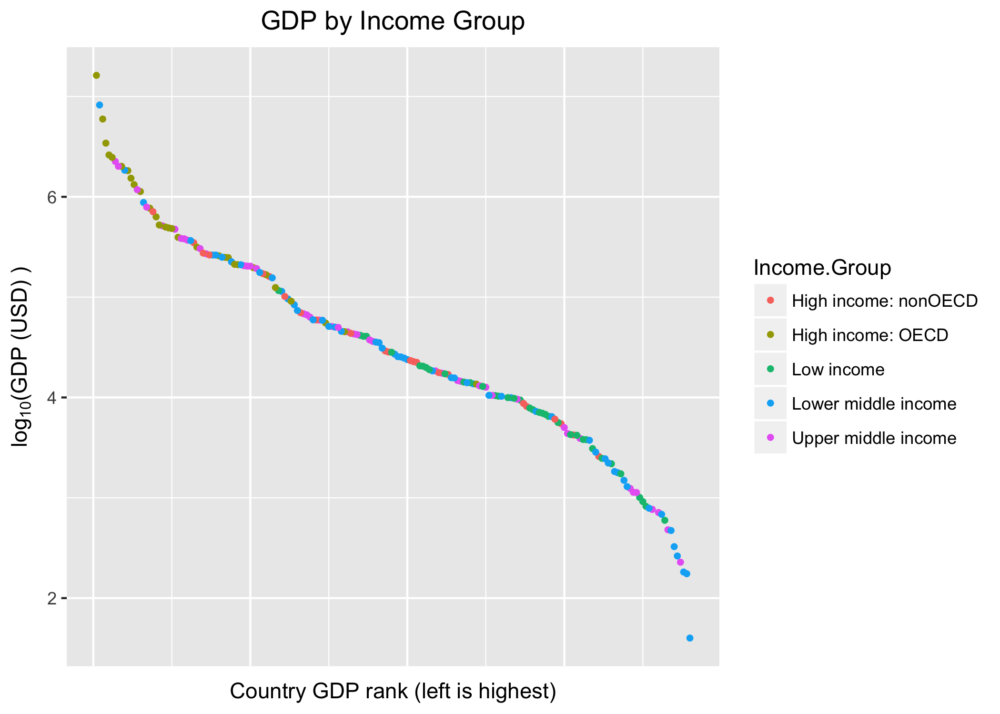

# DS6306 (DoingDataScience) Midterm Case Study #1
### October 25th 2017

### Submitted by:
* Lu Chent
* Eric Balke
* Anthony Schams
* Travis Deason

## Project Contents
* 6306_case_study.Rmd - Contains code needed to generate files
* 6306_case_study_rmd.md - Contains output, analysis and code
* data:
>* EDSTATS_Country.csv - contains relative statistics on all countries 
>* gdp2012.csv - contains the GDP of all countries in 2012
* source:
>* clean_data.R - code needed to tidy and convert the data from data folder into usable dataframes
* images:
*> gdp.png - contains gdp data for all countries ordered by rank and color grouped by income group
*> loggdp.png - contains log_10 transformed gdp data for all countries ordered by rank and colored by income group

## Project Overview
>* complete project with code is in 6306_case_study.RMD

#### Introduction:
We are living in an increasingly global world. With the rapid developement of technology in the past century, we have gone from countless small, mostly isolated populations to one large, connected population on the global scale. With technological and scientific development came economic and population growth on a global scale. Still, countries underwent different levels of growth. We will be comparing the GDP's of several countries and examine some factors that are related to GDP. 


We have complete GDP data (Raw GDP and Income Group) for 189 different countries in the world. 

We can see that the country with the 13th lowest GDP is St. Kitts and Nevis. 

The Organisation for Economic Co-operation and Development (OECD) is an international economic organization involving the governments of 35 countries across the world. Member countries commit themselves to democracy and a market economy and cooperate with one another to identify and implement practices and policies with the ultimate goal of economic growth and security for their citizens.
The members of OECD are in general stronger economically than non-OECD countries. 

We can see that members of the OECD are generally higher ranked than non-members, with the average rank of members being 32.9667 and non-members having averge rank of 91.91394.

* Histogram of GDP for all countries, colors grouped by Income.Group


* Scatterplot of GDP for all countries, colors grouped by Income.Group


This scatterplot confirms the previous observation, OECD members generally have higher GDPs than non members. Not only that, it illustrates that high income non-OECD members have lower GDP than some countries with lower incomes. At this scale however, it is difficult to discern the differences in income between most countries because of extremely large outliers. We will therefore examine log-transformed data. 



Looking at the log_10(GDP), it becomes more clear that some high income non-OECD members have lower GDPs than lower income countries. Another interesting observation is that many of the lowest GDP countries are lower middle income or upper middle income, while many low income countries are in the median of income. We even see some lower middle income countries with very high GDPs.


                  
|                   | High income: nonOECD | High income: OECD | Low income  | Lower middle income | Upper middle income
|-------------------|----------------------|-------------------|-------------|---------------------|--------------------|                 
|   High GDP        |                   4  |              18   |       0     |         5           |       11           |
|   Medium-High GDP |                   5  |              10   |      1      |        13           |        9           |
|   Medium GDP      |                   8  |               1   |       9     |        12           |        8           |
|   Medium-Low GDP  |                   4  |               1   |      16     |         8           |        8           |
|   Low GDP         |                   2  |               0   |      11     |        16           |        9           |
                  

|      country.code  |   country.name    | rank  |   gdp    |
|--------------------|-------------------|-------|----------|
|34           CHN    |         China     |     2 |  8227103 |
|51           EGY    |  Egypt, Arab Rep. |    38 | 262832   | 
|77           IDN    |    Indonesia      |   16  | 878043   |
|78           IND    |     India         |  10   | 1841710  |
|165          THA    |     Thailand      |  31   | 365966   |
```
And indeed there are 5 Lower middle income countries in the top fifth quantile: China, Egypt, Indonesia, India, and Thailand.
